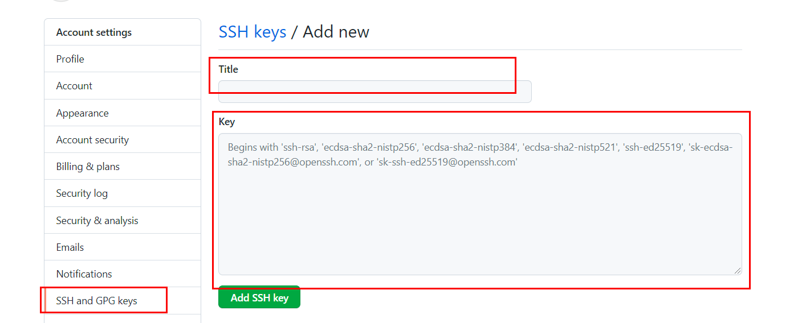

# ComputerKnowledge
包含计算机网络，操作系统等开发岗位常涉及的知识点

# 2个git仓库 使用
### 1. 生成2个对应的仓库密钥/公钥
注意：密钥的添加是要添加的是SSH的密钥，在github的个人SSH密钥中

### 2. 在密钥的目录下设置config文件,内容如下： 
##### 第一个账号，默认使用的账号
Host gitlab.alibaba-inc.com  
HostName gitlab.alibaba-inc.com  
User sakura.cy@alibaba-inc.com  
IdentityFile ~/.ssh/id_rsa  
##### 第二个账号
Host github.com  # second为前缀名，可以任意设置  
HostName github.com  
User 3129877438@qq.com  
PreferredAuthentications publickey  
IdentityFile ~/.ssh/id_0419  
### 3. 查看是否成功链接
ssh -T github.com  
报错：3129877438@qq.com@github.com: Permission denied (publickey).
### 4. 若报错需要联系远程地址
查看原先远程地址是否被添加上  
git remote -v
如果没有添加上，需要对要新增加的地址进行添加。   
原先远程用origin,因与原先仓库重复，用了use.  
git remote add use https://github.com/chen-xiaoyu/ComputerKnowledge.git
### 5. 如果远程使用的是https的地址，需要更改为SSH的地址 
更改命令如下：
git remote set-url origin git@github.com:chen-xiaoyu/ComputerKnowledge.git